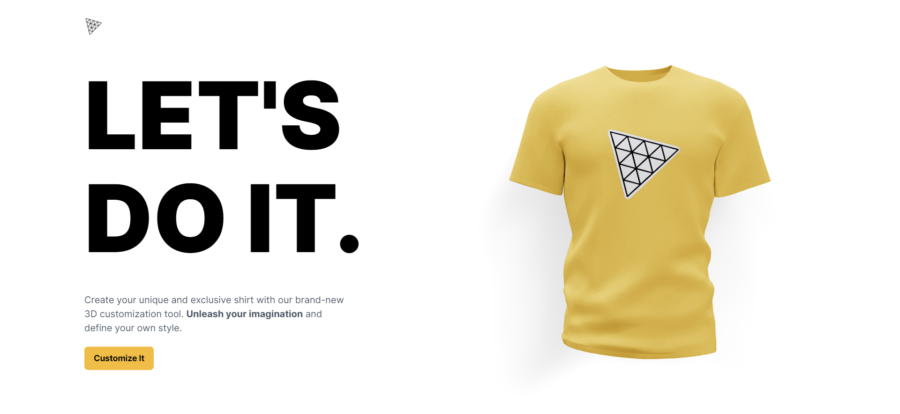
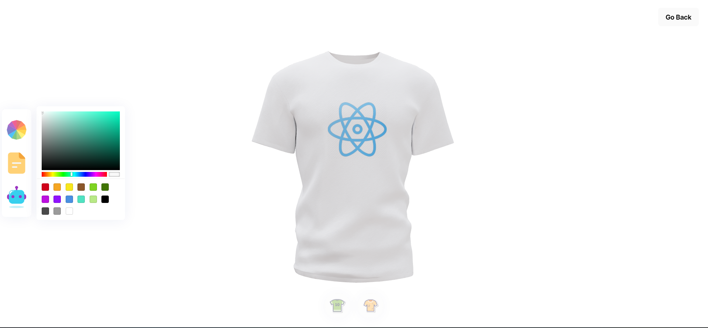

# 3D T-Shirt Customizer

## Screenshots

<p align="center">
  
  
</p>

## Introduction

Many large corporations already use 3D graphics to showcase their products. This ThreeJS 3D product website is infuse it with the power of artificial intelligence! Load, create and customize stunning 3D models and geometries with various lights, as well as understand the 3D world with a camera and positioning of an object in space. The over all color of text and background also change when you customize the color of the shirt.

Libraries Used:

- ThreeJS - a powerful 3D graphics library for rendering and animating the 3D model
- React Three Fiber - a popular library for creating 3D graphics with ThreeJS in React
- TailwindCSS - a popular utility-first CSS styling framework
- Framer Motion - the most popular library used to bring your React website to life with animations
- Valtio - Valtio makes proxy-state simple for React and Vanilla
- Maath - This is a collection of useful math helpers, random generators, bits and bobs. The library is mostly meant to be used with three.js,

Feature

- [x] Custom color and file support.
- [ ] Generate and use images through DALLE AI
- [x] Download the resulting t-shirt model image
- [x] Responsiveness across all devices and improve site's performance

## To Run

```
npm i
npm run dev

```
