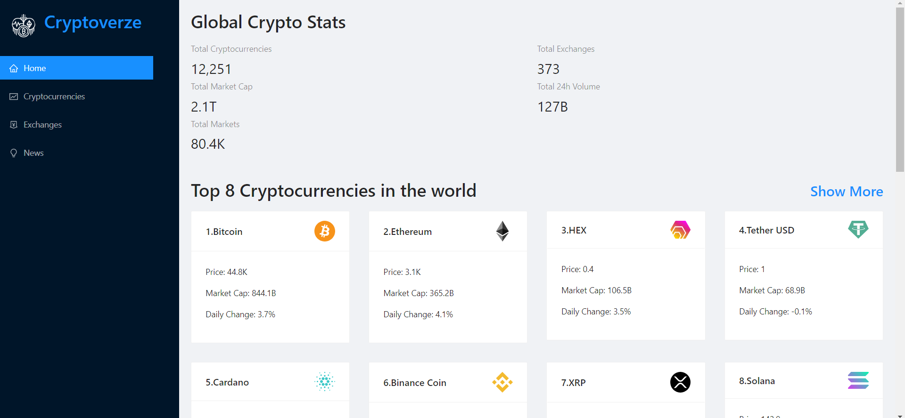

# cryptoverse

A Cryptocurrency information and news website build with ReactJS, ant-design, reduxjs/toolkit, chart.js and RestAPI from Rapid API. Here user can find the lists of top 100 cryptocurrencies their current price, market cap and daily changes, their specific full details and also search for cryptocurrencies news.

## ScreenShots




## Run the Project

```properties
npm i
npm run dev
```
