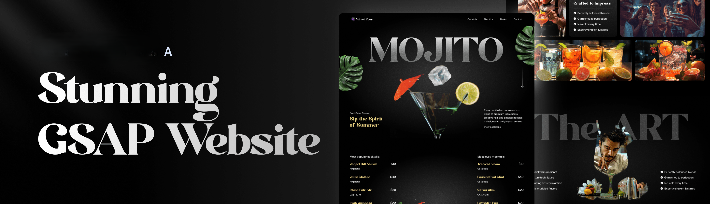
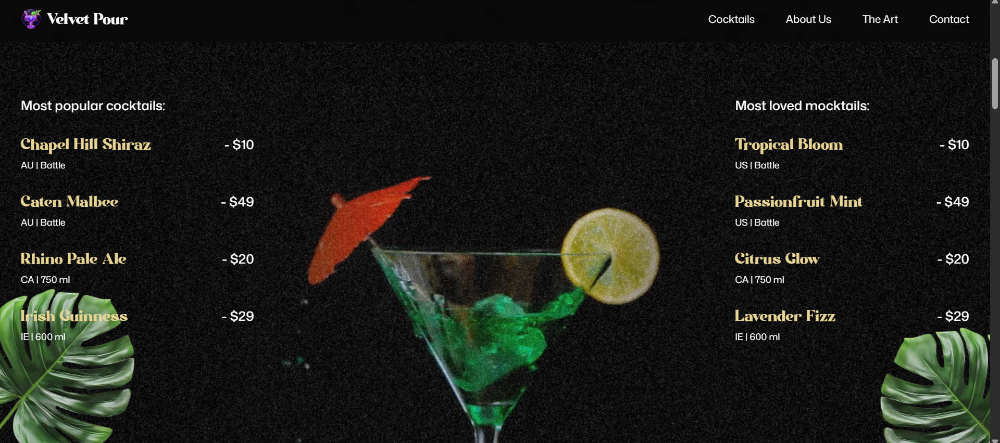
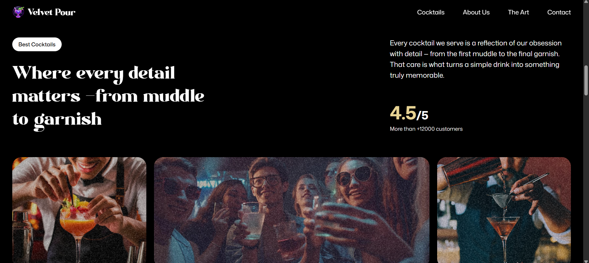
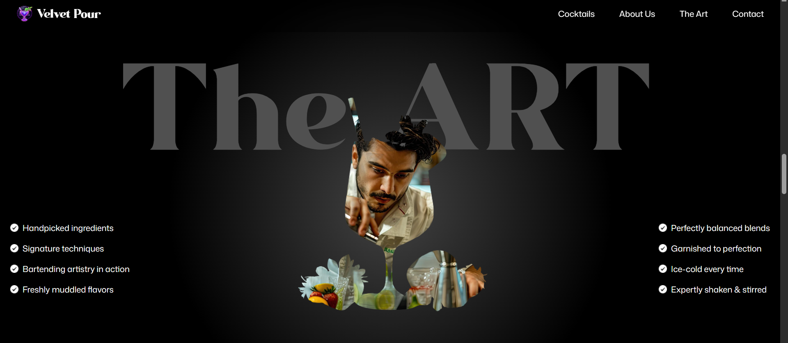
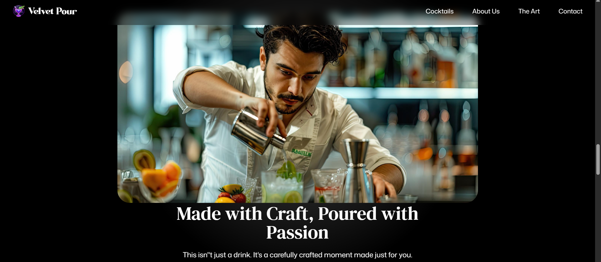
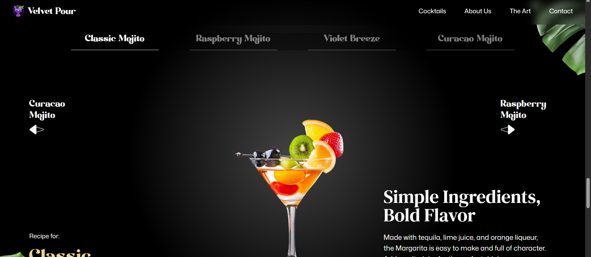

<div align="center">
  <br />
      
  <br />

   <div>
    
    
    
  </div>

  <h3 align="center">Stunning GSAP Mojito Website</h3>
  <div align="center">
      
      
      
      
      
      
    </div>
</div>

## 📋 <a name="table">Table of Contents</a>

1. 🤖 [Introduction](#introduction)
2. ⚙️ [Tech Stack](#tech-stack)
3. 🔋 [Features](#features)
4. 🤸 [Quick Start](#quick-start)

## <a name="introduction">🤖 Introduction</a>

A stunning GSAP-powered cocktail website built using React and Tailwind CSS—a modern, scroll-driven experience packed with advanced animations. Bring the design to life with dynamic SplitText reveals, smooth parallax scrolling, and scroll-triggered effects using GSAP’s ScrollTrigger. Lock sections in place with pinned animations, sync video playback to scroll position for cinematic storytelling, and enhance visual impact with scroll-based image masking. Created a custom animated carousel, crafted seamless timeline animations across sections, with a fully responsive UI that adapts beautifully across all screen sizes.

## <a name="tech-stack">⚙️ Tech Stack</a>

- **[GSAP](https://gsap.com/)** is a powerful JavaScript animation library used in this project to create dynamic, scroll-driven visuals. Features include SplitText animations for bold text reveals, ScrollTrigger for timeline control, parallax scrolling, pinned sections, scroll-synced video playback, seamless multi-section timelines, image masking effects, and a fully custom animated carousel.

- **[React](https://react.dev/)** is a declarative JavaScript library for building interactive UIs. It provides the component structure for modular development, allowing smooth integration of GSAP animations, reusable logic for scroll behavior, and support for responsive layout and state-driven UI features like carousels and video sections.

- **[Tailwind CSS](https://tailwindcss.com/)** is a utility-first CSS framework that allows developers to design custom user interfaces by applying low-level utility classes directly in HTML, streamlining the design process.

- **[Vite](https://vitejs.dev/)** is a lightning-fast build tool and development server that powers this project’s workflow. It enables instant hot module replacement, fast startup, and optimized production builds—ideal for an animation-heavy React site with smooth, real-time development feedback and minimal config.

## <a name="features">🔋 Features</a>

👉 **SplitText Animations**: Impactful text reveals using GSAP’s SplitText for dynamic intros and section highlights.

👉 **ScrollTrigger Effects**: Power scroll-based animations and timeline control with GSAP’s ScrollTrigger.

👉 **Parallax Scrolling**: Immersive depth with smooth parallax effects that respond to user scroll.

👉 **Pinned Sections**: Lock sections in view while animating content for engaging scroll experiences.

👉 **Scroll-Synced Video Playback**: Synced video progress with scroll position for cinematic storytelling.

👉 **Image Masking Effects**: Used scroll-triggered pins and masks for visually striking image transitions.

👉 **Custom Carousel**: A fully customized carousel with multiple navigation options and animated slides.

👉 **Seamless Timeline Animations**: Crafted smooth animation timelines that span across multiple sections.

👉 **Responsive Design**: Ensured fluid UI and adaptive GSAP animations across all screen sizes.

## <a name="quick-start">🤸 Quick Start</a>

Follow these steps to set up the project locally on your machine.

**Prerequisites**

Make sure you have the following installed on your machine:

- [Node.js](https://nodejs.org/en)
- [npm](https://www.npmjs.com/) (Node Package Manager)

**Getting the Repository**

- Copy this folder link `https://github.com/Ulrich-Tonmoy/react-web-apps/tree/main/React/mojito`.
- Download the folder with [download-directory](https://download-directory.github.io/) or [DownGit](https://minhaskamal.github.io/DownGit) and unzip it.
- Open the folder wth [vs code](https://code.visualstudio.com/download) or Terminal.

**Installation**

Install the project dependencies using npm:

```bash
npm install
```

**Running the Project**

```bash
npm run dev
```

Open [http://localhost:3000](http://localhost:3000) in your browser to view the project.
