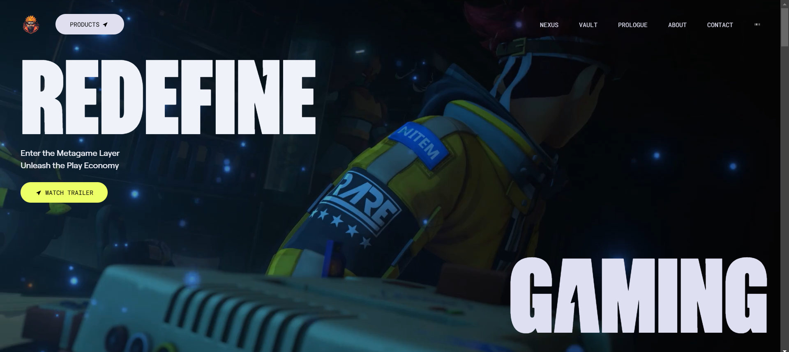

<div align="center" title="Zentry">
  <br />
      
  <br />

  <div>
    
    
    
  </div>
</div>

## 📋 <a name="table">Table of Contents</a>

1. 🤖 [Introduction](#introduction)
2. ⚙️ [Tech Stack](#tech-stack)
3. 🔋 [Features](#features)
4. 🤸 [Quick Start](#quick-start)
5. 🕸️🔗🚀

## <a name="introduction">🤖 Introduction</a>

Website inspired by **[Zentry](https://zentry.com/)**, featuring scroll-triggered animations, geometric transitions, and engaging video storytelling.

## <a name="tech-stack">⚙️ Tech Stack</a>

- GSAP
- React.js
- Tailwind CSS

## <a name="features">🔋 Features</a>

👉 **Scroll-Based Animations**: Dynamic animations triggered by scrolling for a more engaging user experience.

👉 **Clip Path Shaped Animations**: Unique geometric transitions using CSS clip-paths to create visually stunning effects.

👉 **3D Hover Effects**: Interactive 3D transformations that respond to user interactions for a modern feel.

👉 **Video Transitions**: Seamlessly integrated video elements to enhance storytelling and flow.

👉 **Smooth UI/UX**: Polished interfaces with buttery-smooth interactions for an intuitive user journey.

👉 **Completely Responsive**: Flawless adaptation across all devices, ensuring a consistent experience.

and many more, including code architecture and reusability

## <a name="quick-start">🤸 Quick Start</a>

Follow these steps to set up the project locally on your machine.

**Prerequisites**

- [Node.js](https://nodejs.org/en)

**Installation**

Install the project dependencies using npm:

```bash
npm install
```

**Running the Project**

```bash
npm run dev
```

Open [http://localhost:3000](http://localhost:3000) in your browser to view the project.

> This project uses some assets and fonts from **[Zentry](https://zentry.com/)** purely for educational and demonstration purposes. All rights to these assets and fonts belong to their respective owners.This project is not affiliated with or endorsed by **[Zentry](https://zentry.com/)**.
